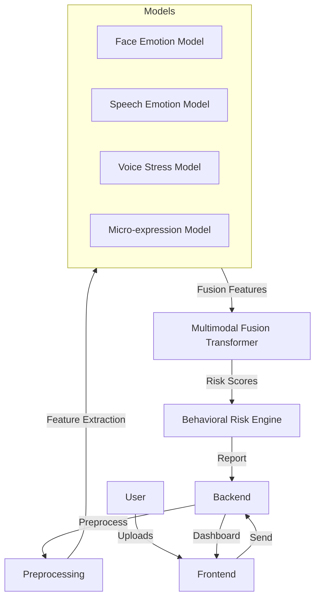

# System Architecture

## High-Level Diagram

## Component Overview
- **Preprocessing:** Handles data normalization, resizing, frame extraction, MFCC/Pitch extraction.
- **Models:**
    - Face: ResNet50 (FER2013).
    - Speech: CNN+LSTM (RAVDESS).
    - Voice Stress: MLP/CNN (MFCC+Pitch/Energy/Jitter/Shimmer).
    - Micro-expression: 3D CNN+Optical Flow (CASME II).
- **Multimodal Fusion:** Transformer-based fusion (Cross Attention).
- **Behavioral Risk Engine:** Classifier (Low/Medium/High).
- **Explainable AI:** SHAP/Attention visualization.
- **Backend:** Flask API.
- **Database:** PostgreSQL/SQLite (Sessions, Emotion, Voice tables).
